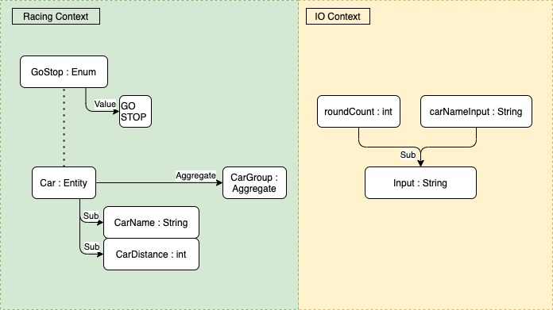

# 자동차 경주 게임
## 진행 방법
* 숫자 야구 게임 요구사항을 파악한다.
* 요구사항에 대한 구현을 완료한 후 자신의 github 아이디에 해당하는 브랜치에 Pull Request(이하 PR)를 통해 과제를 제출한다.

## 과제 제출 과정
* [과제 제출 방법](https://github.com/next-step/nextstep-docs/tree/master/precourse)

## 1. 요구사항 정의
### 1.1. 과제 진행 요구사항
|상세|구현 방법|비고|
|:---|---|---|
|•미션은 https://github.com/next-step/java-baseball-precourse 저장소를 fork/clone해 시작한다.|- fork <br> - clone||
|•기능을 구현하기 전에 java-baseball/README.md 파일에 구현할 기능 목록을 정리해 추가한다. |- 요구사항 최초 정리||
|•git의 commit 단위는 앞 단계에서 README.md 파일에 정리한 기능 목록 단위로 추가한다.<br>&nbsp;&nbsp;&nbsp;&nbsp;•AngularJS Commit Message Conventions 참고해 commit log를 남긴다.|- AngularJS Commit<br>&nbsp;&nbsp;&nbsp;&nbsp;Message Conventions 참고||
|•과제 진행 및 제출 방법은 프리코스 과제 제출 문서를 참고한다.|- 과제 제출 문서 참고<br>- 과제 제출|•2021년<br>&nbsp;5월 4일(화)<br>&nbsp;23시 59분까지 <br>&nbsp;GitHub을 통한<br>&nbsp;**미션 제출**과 **메일** 완료|

### 1.2. 프로그래밍 요구사항
|구분|상세|구현 방법|비고|
|:---:|:---|---|---|
|메소드 분리|• 자바 코드 컨벤션을 지키면서 프로그래밍한다.<br>&nbsp;&nbsp;• https://naver.github.io/hackday-conventions-java/|- gradle-editorconfig 적용<br>- gradle-checkstyle 적용<br>- IntelliJ 적용<br>- Github 적용||
| |• indent(인덴트, 들여쓰기) depth를 2가 넘지 않도록 구현한다. 1까지만 허용한다.<br>&nbsp;&nbsp;• 예를 들어 while문 안에 if문이 있으면 들여쓰기는 2이다.<br>&nbsp;&nbsp;• **힌트: indent(인덴트, 들여쓰기) depth를 줄이는 좋은 방법은 함수(또는 메소드)를 분리**하면 된다.|- < 2depth 규칙||
| |• 자바 8에 추가된 stream api를 사용하지 않고 구현해야 한다. 단, 람다는 사용 가능하다.|- stream api 사용하지 말 것||
| |• else 예약어를 쓰지 않는다.<br>&nbsp;&nbsp;• 힌트: if 조건절에서 값을 return하는 방식으로 구현하면 else를 사용하지 않아도 된다.<br>&nbsp;&nbsp;• else를 쓰지 말라고 하니 switch/case로 구현하는 경우가 있는데 switch/case도 허용하지 않는다.|- else 예약어 금지||
| |• 함수(또는 메소드)의 길이가 10라인을 넘어가지 않도록 구현한다.<br>&nbsp;&nbsp;• 함수(또는 메소드)가 한 가지 일만 잘 하도록 구현한다.|- 함수(또는 메서드) 10라인 이하||
|단위 테스트|• 로직에 단위 테스트를 구현한다. 단, UI(System.out, System.in, Scanner) 로직은 제외 <br>&nbsp;&nbsp;• 핵심 로직을 구현하는 코드와 UI를 담당하는 로직을 구분한다.|- 핵심 로직 단위테스트||
| |• JUnit5와 AssertJ 사용법에 익숙하지 않은 개발자는 첨부한 "학습테스트를 통해 JUnit 학습하기.pdf"<br>&nbsp;&nbsp;문서를 참고해 사용법을 익힌 후 JUnit5 기반 단위 테스트를 구현한다.|- 사용법 학습||
|일급콜렉션|• 일급콜렉션을 활용해 구현한다. [참고문서](https://developerfarm.wordpress.com/2012/02/01/object_calisthenics_/) |- 사용법 학습 | |
|패키징|• 모든 원시값과 문자열을 포장한다. [참고문서](https://developerfarm.wordpress.com/2012/01/27/object_calisthenics_4) |- 사용법 학습 | | 

### 1.3. 기능 요구사항
|상세|구현 방법|비고|
|:---|---|---|
|• 주어진 횟수 동안 n대의 자동차는 전진 또는 멈출 수 있다.|[x] 전진, 멈춤 Enum<br>[x] 자동차들 일급콜렉션||
|• 각 자동차에 이름을 부여할 수 있다. 전진하는 자동차를 출력할 때 자동차 이름을 같이 출력한다.|[x] 자동차 클래스<br>[x] 자동차 - 이름, 전진거리 필드<br>[x] '자동차 이름 : 전진거리'출력||
|• 자동차 이름은 쉼표(,)를 기준으로 구분하며 이름은 5자 이하만 가능하다.|[x] 이름은 5자 이하 true, false|[x] 6자 이상인 경우<br> 다시 입력 요청 |
|• 사용자는 몇 번의 이동을 할 것인지를 입력할 수 있어야 한다.|[x] 숫자 이외 입력 예외처리|[x] 숫자 범위 체크 (0 ~ MaxInt)|
|• 전진하는 조건은 0에서 9 사이에서 random 값을 구한 후<br>random 값이 4 이상일 경우 전진하고, 3 이하의 값이면 멈춘다.|[x] random 구하기(0 ~ 9)<br>[x] 4 이상 : 전진, 3 이하 :멈춤||
|• 자동차 경주 게임을 완료한 후 누가 우승했는지를 알려준다. 우승자는 한 명 이상일 수 있다.|[x] 우승자 찾기<br>[x] 우승자 출력|일급콜렉션 내 메소드로 구현(O)|

#### 1.3.1. 프로그램 실행 결과
```
경주할 자동차 이름을 입력하세요.(이름은 쉼표(,) 기준으로 구분)
pobi,crong,honux
시도할 회수는 몇회인가요?
5

실행 결과
pobi : -
crong : -
honux : -

pobi : --
crong : -
honux : --

pobi : ---
crong : --
honux : ---

pobi : ----
crong : ---
honux : ----

pobi : -----
crong : ----
honux : -----

pobi, honux가 최종 우승했습니다.
...
```

## 2. 분석 및 설계
### 2.1. 이번 미션 핵심 목표
> TDD (Test-Driven Developmet) : production code보다 test code를 먼저 작성한다.
>> Cycle : Test Fail ---> Test Passes ---> Refactor ---> Test Fail ---> ... 

> Domain-Driven Design : 도메인 주도 설계
>> 값 객체 (Value Object) : 원시 값과 문자열을 포장한다.
>>> - 변하지 않는다.
>>> - 주고받을 수 있다.
>>> - 등가성을 비교할 수 있다.
>
>> 엔티티 (Entity)
>>> - 값 객체와 마찬가지로 도메인 모델을 표현하는 객체
>>> - 값 객체와 달리 식별자와 일종의 생애주기를 가진다.
>>> - 가변이다.
>>> - 속성이 같아도 구분할 수 있다.
>>> - 동일성을 통해 구별된다.
> 
>> 도메인 서비스 (Domain Service)
>>> - 도메인 모델(엔티티, 값 객체)이 스스로 해결할 수 없는 기능들을 제공해주는 객체
>>>> 예1) 유저이름이 이미 등록되어 있다면 새로 등록할 수 없다. 
>>>> - 본인 엔티티에서 자기 자신이 있는지 확인하는 꼴이니 부자연스업다.
>>>> - 따라서 유저서비스에서 등록여부를 찾도록 해야한다.
>>>
>>>> 예2) 이름은 최소 1자 이상이어야 한다.
>>>> - 해당 기능은 엔티티의 책임이다.
>>>> - 엔티티와 관련된 도메인의 규칙이 서비스에 노출되어 있다.
>>>> - 따라서 도메인 모델이 하기에 부자연스러운 처리로만 한정해야 한다.
>
>> 애그리게이트 (Aggregate) : 일급콜렉션을 활용
>>> - 연관된 객체 묶음
>>> - Aggregate Root : 중심이 되는 객체
>>>> 예) UserGroup (Aggregate) -> User (Aggregate Root)
>>> - 데메테르의 법칙 : 객체 간의 메서드 호출에 질서를 부여하기 위한 가이드라인
>>>> - 객체 자신
>>>> - 인자로 전달받은 객체
>>>> - 인스턴스 변수
>>> - 애그리게이트 경계
>>>> - 기본적으로 경계는 도메인 규칙과 요구사항에 따라 설계
>>>> - 가장 많이 쓰이는 기준은 "변경의 단위"
>> - __해당 내용은 잘 와 닿지 않아 DDD책을 구매하여 읽어봐야할 듯 싶다...__
### 2.2. Todo List
- [x] 0.기본 세팅
  - [x] 0-1. git fork/clone
  - [x] 0-2. 요구사항 정리
  - [x] 0-3. AngularJS Commit Message Conventions 참고
- [x] 1.자바 코드 컨벤션을 위한 세팅
  - [x] 1-1.gradle-editorconfig 적용
  - [x] 1-2.gradle-checkstyle 적용
  - [x] 1-3.IntelliJ 적용
  - [x] 1-4.Github 적용
- [x] 2.학습
  - [x] 2-1.일급콜렉션
  - [x] 2-2.패키징:모든 원시값과 문자열을 포장한다.
  - [x] 2-3.TDD 동영상 학습
  - [x] 2-4.DDD(도메인 주도 설계) 찾아보기
- [x] 3.분석 및 설계(DDD, Domain-Driven Design)
  - [x] 3-1.Domain 구분
  - [x] 3-2.Domain에서 TDD가 용이한 부분, 용이하지 않은 부분 발라내기
- [x] 4.구현
  - [x] 4-1.레이싱 컨텍스트
    - [x] 4-1-1. 자동차 이름 Value Object
    - [x] 4-1-2. 자동차가 간 거리 Value Object
    - [x] 4-1-3. GoStopCode
    - [x] 4-1-4. 자동차 Entity
    - [x] 4-1-5. 자동차들 Aggregate
  - [x] 4-2.IO 컨텍스트
    - [x] 4-2-1. carNameInput Value Object
    - [x] 4-2-2. roundCount Value Object
  - [x] 4-3.IO
    - [x] 4-3-1. RacingCarIO
  - [x] 4-4.UI
    - [x] 4-4-1. DisplayCode
    - [x] 4-4-2. RacingCarUI
- [x] 5.테스트
  - [x] 5-1.Gradle build Success 확인
  - [x] 5-2.checkstyle 문제없는지 확인
  - [x] 5-3.요구사항 조건들 충족했는지 확인
    - [x] 5-3-1.< 2 Depth 규칙
    - [x] 5-3-2.Stream api 사용 금지
    - [x] 5-3-3.else 예약어 금지
    - [x] 5-3-4.함수(또는 메서드) 10라인 이하
    - [x] 5-3-5.핵심 로직 단위테스트
- [x] 6.인수인계
  - [x] 6-1.과제 제출 문서 참고
  - [x] 6-2.과제 제출 (2021년 5월 4일(화) 23:59까지, Github 제출 + 메일전송)
  
### 2.3. DDD(Domain-Driven Design) 구성도
- ~~하향식의 설계보다 상향식의 설계도 해보자!~~
- 보다 객체지향적 설계를 위한 것이다.
- 정해진 도식 규칙은 추후 확인이 필요하다.
- 

## 3. 느낀점 & 배운점
### 3.1. TDD
- '코딩을 하고 필요시 테스트한다.' -> '다양한 테스트가 적용되는 코드를 작성한다.'
- 기존 코딩할때는 큰 단위 접근 후 작은 단위로 리펙터링하는 구조여서 요구사항 조건들을 충족하기가 너무 어려웠습니다.
- TDD를 수행하면서...
  - 가장 작은 단위의 메서드를 작성할 수 있었습니다.
  - '< 2 depth 규칙', 'else 예약어 금지', '함수 10라인 이하'가 쉽게 적용되는 것이 놀라웠습니다.
  - 코드를 수정하면서 발생하는 side effect를 테스트 코드를 실행하면서 반복적이고 효과적인 테스트를 수행할 수 있었습니다.
  - 리펙터링이 쉽게 이루어졌습니다.
  - 접근제어자의 컨트롤을 쉽게 할 수 있었습니다. 과거에는 접근제어자에 맞춰서 쫓아가고, 돌아와서 수정하는 일이 많았습니다.
- 어려웠습니다. 그리고 익숙하지 않았습니다.
  - 생각을 바꾸는, 패러다임을 깨우치는 것이 참 어려웠습니다.
  - 작게 쪼개서 접근은 쉽지 않았습니다.
  - 실제 개발 환경에서 꼭 적용해보고 싶습니다.

### 3.2. DDD
- 이번 요구사항으로 주어진 내용과 TDD 강의 중 DDD에 대한 언급을 하셔서 찾아보게 되었습니다.
- 보다 더 객체지향적인 개발을 할 수 있었습니다.
- 경계(boundary)를 선정하는 것이 참 어려웠습니다.
  - 어떤 메서드를 Value Object에 써야하고, Entity에 써야하고, Aggregate(일급컬렉션)를 활용하는지 좀 더 객체 지향적으로 생각하게 되었습니다.
- 책을 읽어서 보다 심도 있는 공부를 해야 실제 업무에서 적용할 수 있을 것 같습니다.
  - 기존에는 POJO 형식을 활용한 객체, 인스턴스를 활용했지만 결국 모든 활용은 Service에 진중되는 현상으로 참 불편했습니다.
  - DDD를 활용하면 엔티티의 상속, 인터페이스를 통한 OOP에 충실한 프로그래밍이 될 것 같아 흥미로웠습니다.
  - Service에 들어간 기능의 대부분을 Value Object, Entity, Aggregate에 들어감으로써 Service의 기능이 가벼워지는 것을 기대합니다.
  
### 3.3. 부족한 점
- Convention을 간과하고 개발했던 지난 날이 부끄러웠습니다.
  - git commit convention 을 활용하는 도중 '#'넘버링을 잘못 활용하여 엉뚱한 링크를 생성했습니다.
  - java, spring을 많이 활용해서 잘한다고 생각했으나, 인스턴스 변수, 클래스 변수도 헷갈려하는 스스로를 반성했습니다. 
  - 컨벤션을 지키지 않은 코딩이라 보여드리기 민망합니다...
- 편함을 고수하려는 '변화를 받아들이지 못하는 생각'이 부끄러웠습니다.
  - 책을 읽어서 지식을 쌓음은 있었으나, 실무에 적용하는 것을 두려워했습니다.
  - 좋은 서적을 읽었어도 사용하지 않으니 OOP에 맞는 개발을 소홀히 했던 것을 반성하게 되었습니다.
  
### 3.4. 피드백 요청
- git convention
  - 하나의 기능을 커밋할때 docs, feat, fix 등 여러 활동을 하게 되는데 한꺼번에 작성하는 것인지, 따로 작성해서 구분하여 커밋하는 것인지 궁금합니다.
  - 같이 작성한다면 feat: ~~~, docs: ~~~ VS. feat, docs: ~~~~~~~ 인지 헷갈립니다.
  - 훌륭한 git convention 작성법에 대한 예제가 있으면 실무에도 잘 적용해보고 싶습니다!
